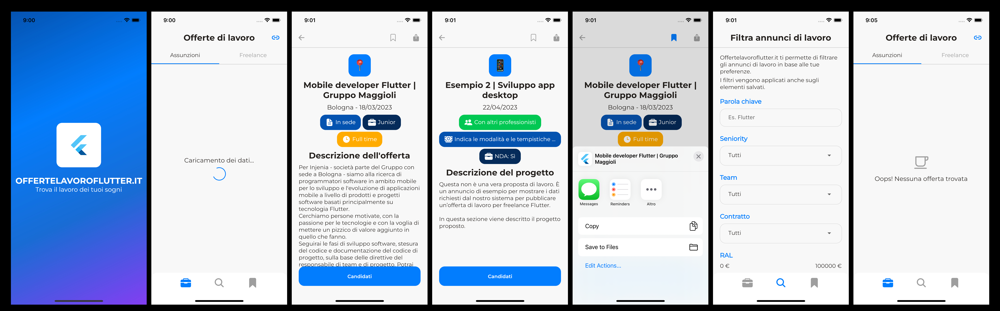

# Punteggio

-   UI/UX: 7/10
-   Struttura progetto: 9/10
-   Pulizia del codice: 8/10
-   Ottimizzazione del codice: 8.5/10
-   https://github.com/antoniopetricc/OfferteLavoroFlutter

# Osservazioni

-   App molto semplice e quindi con una UI molto semplice, ed una UX che ne giova essendo che è tutto molto semplice ed intuitivo
-   In home l'immagine di leading dell'annuncio ruba troppo spazio alle informazioni, sopratutto contando che è marginale
-   Gli stili degli annunci non sono stati preservati
-   Particolare la scelta dell'uso di un intera pagina per i filtri, lato UX però è poco intuitiva
-   L'app ha anche un design system ed è consistente come presentazione
-   Manca un refactoring dei metodi di UI, alcuni sono veramente troppo lunghi
-   Progetto strutturato in maniera semplice ed efficace, è stato facile capire il suo funzionamento

# Funzionalità usate

-   BLoC & Cubit
-   Repository
-   Design system
-   Uso di spinner per loading (non ideale)
-   Struttura del progetto
-   Gestione errori
-   Funzionalità sharing

# Screenshots

