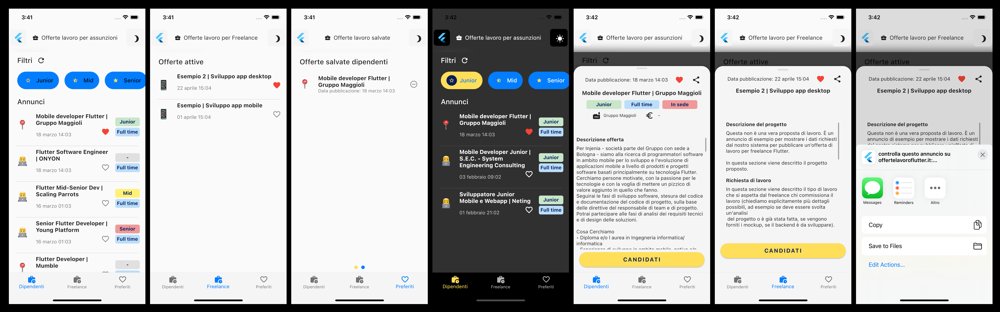

# Punteggio

-   UI/UX: 6.5/10
-   Struttura progetto: 9/10
-   Pulizia del codice: 7.5/10
-   Ottimizzazione del codice: 8.5/10
-   https://github.com/androidan/offertelavoroflutterapp

# Osservazioni

-   A livello di UX ci sono tante piccole imperfezioni che danneggiano l'utilizzo dell'app: primo fra tutti quando si consulta un annuncio e si scrolla in basso e poi in alto, il SlidingUpPanel si chiude
-   Tante piccole imperfezioni anche a livello di UI: piccolezze ma che nell'insieme danno un effetto di app non curata
-   Sono stati usati diversi colori all'interno dell'app, manca una certa coerenza in fatto di design system
-   Il tema scuro ha una scelta di colori particolare che però esteticamente stonano
-   In caso di mancanza di connessione internet, l'app va in crash
-   Avrei aggiunto una notifica quando si aggiunge un annuncio ai preferiti
-   Carino il funzionamento dinamico dello sharing (apre l'app corretta a seconda dell'annuncio)
-   A livello di pulizia del codice ci sono alcune parti di UI che sono troppo lunghe, avrei optato per metodi più corti

# Funzionalità usate

-   BLoC & Cubit
-   Repository
-   Struttura del progetto
-   Funzionalità sharing
-   Refactoring dell'UI
-   Stili negli annunci preservati (in parte)
-   Dark mode
-   Uso di shimmer per loading

# Screenshots

