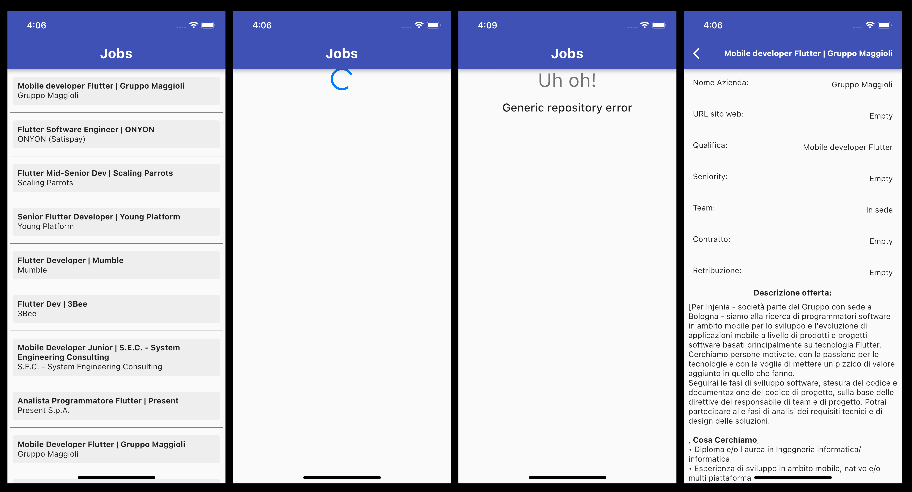

# Punteggio

-   UI/UX: 6/10
-   Struttura progetto: 8.5/10
-   Pulizia del codice: 9/10
-   Ottimizzazione del codice: 8/10
-   https://github.com/Matteo2L/offertelavoroflutter.git

# Osservazioni

-   App molto semplice, ne consegue che l'UI e la UX lo sono altrettanto.
-   La UI ha un buon contrato di colori ma non ha una gerarchia ben impostata di grandezze (es: titoli e paragrafi)
-   Manca un branding forte dell'app
-   Manca la parte degli annunci Freelance
-   Codice strutturato bene, facilmente navigabile ed è un buon esempio di codice per un app semplice

# Funzionalità usate

-   BLoC
-   Dependency injection
-   Architettura PINE
-   Struttura del progetto
-   Gestione errori
-   Gestione connessione internet
-   Refactoring dell'UI
-   Stili negli annunci preservati (parzialmente)
-   Uso di spinner per loading (non ideale)DependencyInjectorHelper

# Screenshots

