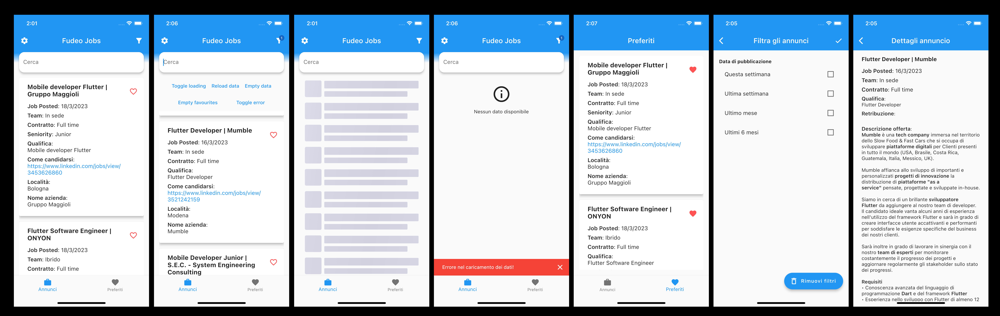

# Punteggio

-   UI/UX: 6.5/10
-   Struttura progetto: 8/10
-   Pulizia del codice: 9/10
-   Ottimizzazione del codice: 8/10
-   https://github.com/mattmusc/hackaton_fudeo_jobs

# Osservazioni

-   UX semplice ed efficace, UI un po' troppo basilare
-   Progetto strutturato bene
-   Pattern Flutter usati bene
-   Bella la modalità sviluppatore
-   App con un UI molto semplice, il che la rende facilmente utilizzabile e comprensibile, ma non le da un identità ed un branding.
-   Contrasto di alcuni componenti troppo poco marcato (TabBar, Cards in Home)
-   I filtri sono segnati come checkbox ma in verità funzionano come una specie di radio, controintuitiva per l'utente (UX)

# Funzionalità usate

-   Change notifier
-   Variabili d'ambiente
-   Refactoring dell'UI
-   Stili negli annunci preservati
-   Uso di shimmer per loading
-   Struttura del progetto
-   Gestione connessione internet

# Screenshots

