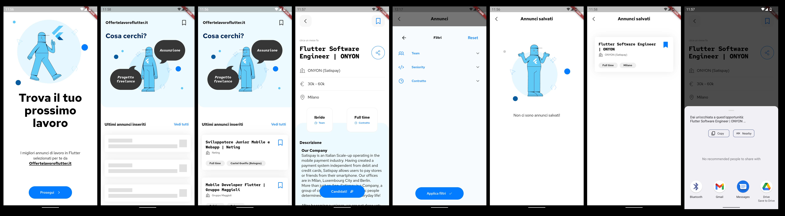

Si è concluso il primo Hackathon Fudeo e, data la partecipazione e l’impegno dei partecipanti, possiamo tranquillamente affermare che questo è stato il primo di tanti!

Quando abbiamo avuto l’idea di organizzare questo Hackathon ci chiedevamo quanti avrebbero partecipato, se l'obiettivo sarebbe piaciuto e se le persone avrebbero trovato del tempo per questa iniziativa.

A sfida conclusa, siamo felici dei 40 partecipanti e 13 progetti consegnati e ancora di più dell'impegno dimostrato per questa competizione:

vorremo invitare tutti a cena per una pizza e congratularci con ognuno perché non c'è stato un singolo progetto che sia stato fatto male o consegnato tanto per partecipare.

C’è chi ha passato centinaia di ore a sviluppare l'app (e si vede!) e chi invece ha fatto il possibile con il tempo che ha potuto dedicare, siamo grati con ognuno dei partecipanti!

Fatti i ringraziamenti, entriamo nello specifico dell’Hackathon 🙂

Fudeo è sinonimo di formazione su Flutter, quindi anche in questo evento abbiamo voluto che tutti quanti potessero portarsi qualcosa a casa, oltre l’esperienza.

Ecco perché i progetti consegnati sono open e per ognuno di essi abbiamo aggiunto le nostre osservazioni tecniche:

è un’ottima occasione per imparare dal codice degli altri.

In questo modo chi ha realizzato l'app dell’Hackathon ha l'opportunità di vedere come alcune feature sono state implementate da altri (abbiamo cercato di raccogliere alcune funzionalità salienti di ogni app durante la valutazione). Coloro che non hanno partecipato e vorrebbero sperimentare un po’, potrebbero provare a farsi la propria app in locale e poi confrontarla con quelle consegnate.

    Specifiche tecniche app
    👉 https://link.fudeo.it/hackathon-specifiche-tecniche

    Post con info sul premio
    👉 https://www.fudeo.it/blog/hackathon-flutter-offertelavoroflutter

Come anticipato a inizio evento, nei prossimi giorni valuteremo se pubblicare l’app vincitrice sugli store:

l’idea è di donarla a tutta la community italiana di sviluppatori Flutter, che avrebbero uno strumento in più per cercare nuovi lavori da freelance oppure assunzioni in azienda.

# 1° Classificato: UX & Codice

**Filippo Mazzamuto**

https://github.com/Fudeo-it/hackaton-1st-edition/tree/main/FilippoMazzamuto

App che racchiude veramente tutto: design, funzionalità, accessibilità e struttura codice. E' l'app con il mix di UI e codice che ci è piaciuta di più.

# 2° Classificato: UI & UX

**Emanuele Gandolfi**

https://github.com/Fudeo-it/hackaton-1st-edition/tree/main/EmanueleGandolfi

App molto bella esteticamente e molto ben pensata, c'è stato uno studio di UI ed UX fatto bene e si nota all'interno dell'app. Ha anche parecchie funzionalità implementate, l'unico appunto negativo che abbiamo notato è in fatto di alcune scelte tecniche sul codice del progetto che rendono alcune sue parti più fragili rispetto ad altri progetti o scelte architetturali che potrebbero essere migliorate.

# 3° Classificato: Codice

**Simone Parodi**

https://github.com/Fudeo-it/hackaton-1st-edition/tree/main/SimoneParodi

Ci è piaciuta molto la struttura del progetto: mix ideale tra semplicità e pulizia del codice. Progetto più consigliato per vedere come strutturare bene un progetto Flutter. La UI e UX sono molto semplici ed efficaci, ma mancano alcune funzionalità che altri invece hanno implementato o più cura in generale nell'aspetto grafico.

# Menzioni speciali

**Team Blocbusters**

https://github.com/Fudeo-it/hackaton-1st-edition/tree/main/TeamBlocbusters

UI migliore dell'Hackaton, illustrazioni, colori, accessibilità e branding app veramente ben fatte. UX andrebbe migliorata in diversi suoi punti ed inoltre il codice è stato molto modularizzato, forse fin troppo.

